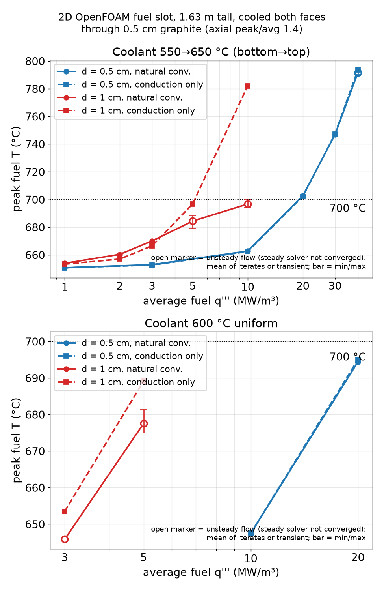
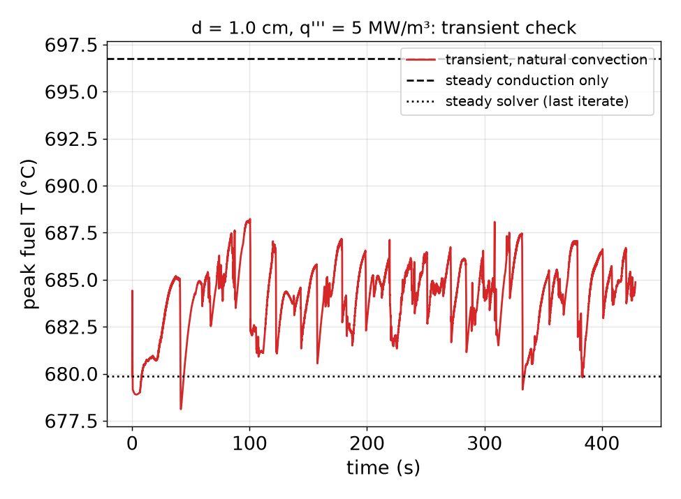
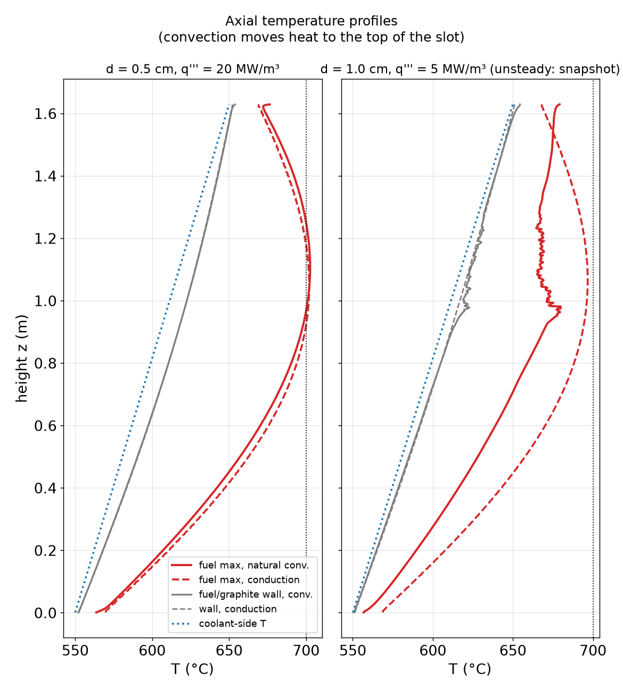
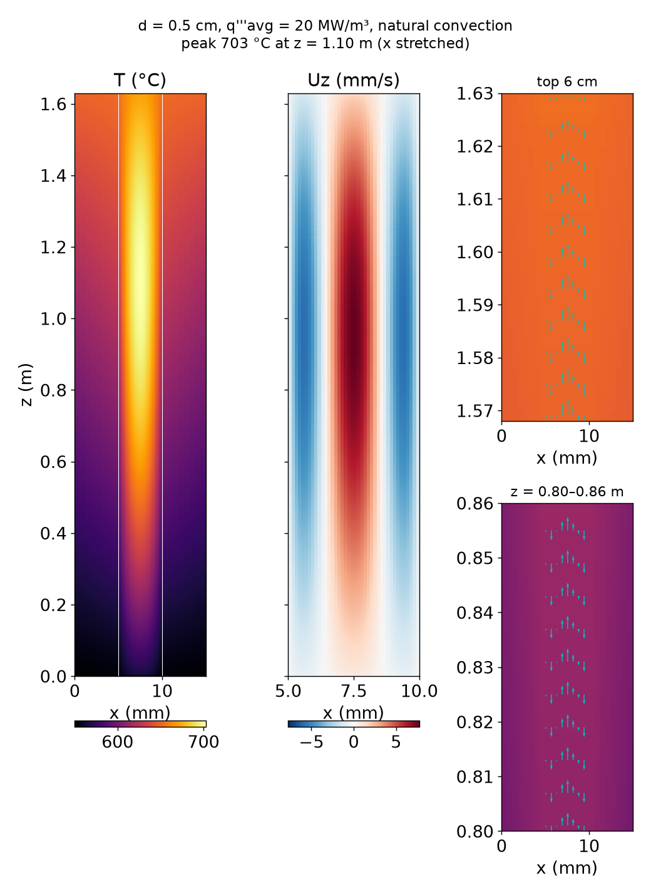

# 2D OpenFOAM model: natural convection in a stagnant fuel slot

This folder has a 2D conjugate heat transfer (CHT) model of one vertical fuel-salt slot in the graphite-plate core (see `../graphite_slab_core`). The question it answers: how much does natural convection in the tall, stagnant fuel slot raise the allowed power above the conduction-only limit?

**Short answer**
- **0.5 cm slot:** natural convection does almost nothing. Peak fuel temperature matches conduction within about ±3 K at every power, and the allowed power is the same.
- **1.0 cm slot:** convection helps. The flow becomes unsteady (multicellular) and cuts the peak temperature rise by roughly 2x at high power. The allowed q''' rises from about 5.2 to about 10 MW/m³ (roughly 8.5–11.5).
- The core-power estimates below use V_fuel = 0.586 m³ and radial peaking 2.3:
  - 0.5 cm slot: q'''avg ≈ 19.4 MW/m³ → P_core ≈ 4.9 MW.
  - 1.0 cm slot: ≈ 1.3 MW with conduction only, and ≈ 2.2–2.9 MW with convection.
- The coolant-side film is not in these numbers (the coolant face temperature is fixed). A realistic laminar coolant-side h is in the few-hundred W/m²K range, and at that h the film drop, not the fuel slot, sets the limit. See "Coolant-side sensitivity" below.



## Model

**Geometry.** The model is a vertical x–z plane through one fuel slot, running along its length. x runs across the slot depth and z is vertical. The domain is one cell thick in y, with `empty` front and back faces.

```
x:  0 ........ 5 mm ............ 5 mm + d_f ............ 10 mm + d_f
    | graphite |    fuel salt (d_f)    |    graphite     |
 coolant BC                                          coolant BC
z = 0 ... H = 1.63 m. The fuel top and bottom are closed, adiabatic, no-slip walls (zero net flow).
```

- Both faces of the fuel slot are cooled through a **0.5 cm shared graphite wall**. This follows the repo's plate stacking `F | wall | C | wall | F ...`: the open face of a fuel slot is closed by the backing wall of the neighbouring coolant plate, so every fuel slot has a coolant row on each side.
- The full slot depth is modelled, with no symmetry plane, so the flow is free to become asymmetric. d_f = 0.5 cm and 1.0 cm.
- **Mapping to the one-sided layout.** A model with a symmetry plane and fuel width d_f cooled from one side is equivalent to the 2·d_f case here. So "0.5 cm, one side cooled" corresponds roughly to the 1.0 cm case in this folder, apart from the slip vs no-slip condition on the mid-plane.
- The coolant boundary is applied at the outer graphite face, which is the coolant-wetted surface in this 2D idealisation. The horizontal coolant slots are smeared into a continuous boundary.

**Coolant boundary condition.**
- **Baseline:** fixed temperature, varying linearly from 550 °C at the bottom to 650 °C at the top.
- **Variant `_Tc600`:** 600 °C uniform.
- **Variant `_h1000` / `_h300`:** convective (Robin) condition with h = 1000 or 300 W/m²K to the same linear coolant profile, implemented as a `mixed` BC with valueFraction = h/(h + k/Δn).
- Fixed temperature is the baseline because it isolates the fuel-slot physics the question is about. The coolant film is a separate design lever, covered by the h variants.

**Heat source.**
- The fuel salt has volumetric heating with an axial cosine shape: q(z) = q_peak·cos(π(z − H/2)/H_e).
- H_e = 1.8653 m (= 1.144 H, i.e. 11.7 cm extrapolation at each end) is chosen so that the **axial peak/average = 1.4** exactly.
- It is applied as 163 axial bands of 1 cm, each a `scalarSemiImplicitSource` on the enthalpy `h` at the exact band average of the cosine. The total power is exact.
- q'''avg in all tables is the axial average in this slot.

**Solver.**
- OpenFOAM v1912 (openfoam.com release), `chtMultiRegionSimpleFoam` (steady SIMPLE), laminar, with two regions: `fuel` (fluid) and `graphite` (solid).
- The fuel uses the full variable-density formulation. ρ(T) is linear (`icoPolynomial`) and buoyancy comes from the p_rgh/ρgh formulation, so no Boussinesq approximation is needed.
- **Conduction-only comparison (`_cond` cases):** same cases with `frozenFlow yes` (U ≡ 0, energy equation only) and g = 0.
- **Convection cases:** start from the conduction solution (stage 1, 1000 iterations with frozen flow), then run with buoyant flow.

**Mesh.**
- The base mesh has 40 cells across the fuel slot (0.125 mm for 0.5 cm, 0.25 mm for 1.0 cm), 8 cells across each graphite wall, and 815 cells in z (2 mm). That is 32,600 fuel cells.
- Mesh check on d = 0.5 cm, q = 20 MW/m³:

  | Mesh | Cells (x_fuel × z) | Peak fuel T |
  |---|---|---|
  | coarse | 20 × 408 | 697.5 °C (steady solver did not converge) |
  | base | 40 × 815 | 702.68 °C |
  | fine | 80 × 1630 | 702.49 °C |

  The base mesh is converged to about 0.2 K.

**Steady-solver settings matter.**
- The first attempt used SIMPLE with U 0.5 / h 0.9 relaxation and p_rgh relTol 0.01. It stalled with large continuity errors (mean |∇·(ρU)| ~ 400 kg/m³/s). These acted as spurious mixing: velocities were about 5x too high and the peak temperature about 45 K too low.
- The final settings are p_rgh 0.7, U 0.3 (0.15 for the hardest cases), h 0.5, and p_rgh relTol 0.001. The 0.5 cm cases converge to continuity errors below 0.02, with heat balance out/in = 1.000 ± 0.002.
- The 1.0 cm cases at q''' ≥ 5 MW/m³ never converge to a steady state. The peak temperature keeps wandering by several K between iterations. A **transient restart** (`cases/d10mm_q5_conv_transient`, `chtMultiRegionFoam`, about 300 s of physical time) confirms the flow is **unsteady**: the peak temperature fluctuates between 680 and 687 °C.
- Results are flagged `steady_converged` in the CSV. Open markers in the plot are non-converged steady points, and error bars show the transient min/max.



## Properties (SI; see `scripts/make_case.py`)

| Property | Value used | Source / note |
|---|---|---|
| Fuel salt | 7LiF-BeF₂-ZrF₄-UF₄ 61.83-29.17-5.0-4.0 mol% | as in `../graphite_slab_core` |
| Density | ρ = 3140.0 − 0.59328·T[K] kg/m³ (2593 kg/m³ at 922 K), β = 2.29e-4 1/K | MSRE fuel correlation ρ = 2.575 − 5.13e-4·T[°C] g/cm³ (ORNL-4658, Table 8.2; also ORNL-4865), rescaled ×1.1565 to the 4 mol% UF₄ salt with Cantor's additive molar volumes (ORNL-TM-4308), the same method as the OpenMC model |
| Viscosity | μ = 0.116·exp(3755/T) cP (6.8 cP at 922 K); 5th-order polynomial fit over 800–1250 K, max error 0.35 % | MSRE fuel correlation as used in ORNL-4865 / ORNL/TM-2019/1359 (de Wet & Greenwood, TRANSFORM MSRE model, Eq. 2). Note: ORNL-TM-2316 (Cantor et al. 1968) lists the same expression for LiF-BeF₂ 66-34; for a UF₄/ZrF₄ fuel salt it is an estimate (±15–25 %) |
| Thermal conductivity | k = 1.05 W/m·K (constant) | ORNL-4658/4865 give 1.0 W/m·K. ORNL-TM-3039 (Guymon 1973) gives 1.44 W/m·K for the MSRE fuel. Using 1.44 would cut the conduction ΔT by about 27 % |
| Heat capacity | cp = 1970 J/kg·K | MSRE fuel 0.4735 Btu/lb·°F = 1984 J/kg·K (ORNL-TM-3039, via ORNL/TM-2019/1359 Table 2) |
| Graphite | k = 30 W/m·K, ρ = 1870 kg/m³, cp = 1700 J/kg·K | Irradiated-graphite-like baseline (unirradiated nuclear graphite is about 60–130 W/m·K at temperature; irradiation drops it to about 20–40). ρ = MSRE CGB 1.87 g/cm³. The wall ΔT is small (q''·w/k ≈ 0.6 K per MW/m³ at d = 1 cm), so the graphite k sensitivity is weak |

Williams, ORNL/TM-2006/12 ("Assessment of candidate molten salt coolants for the AHTR") and Janz / Beneš–Konings compilations give values in the same ranges. The fuel property uncertainty (k ±25 %, μ ±25 %) is comparable to or larger than the convection effect for the 0.5 cm slot.

## Results (coolant 550→650 °C linear, fixed coolant-face temperature)

Columns:
- ΔT_fw = max over z of (fuel max − fuel/graphite wall temperature).
- Local conduction/convection ratio = ΔT_fw,cond / ΔT_fw,conv (a Nusselt-like enhancement).
- Peak reduction = T_peak,cond − T_peak,conv.


**d_f = 0.5 cm**

| q'''avg (MW/m³) | peak T conv (°C) | peak T cond (°C) | peak reduction (K) | ΔT_fw conv / cond (K) | cond/conv ΔT_fw ratio | max \|U\| (mm/s) | flow |
|---|---|---|---|---|---|---|---|
| 1 | 650.7 | 650.7 | -0.0 | 4.1 / 4.2 | 1.02 | 0.3 | steady (converged) |
| 3 | 653.0 | 652.7 | -0.3 | 12.2 / 12.5 | 1.02 | 0.9 | steady (converged) |
| 10 | 662.8 | 662.4 | -0.4 | 40.5 / 41.7 | 1.03 | 3.4 | steady (converged) |
| 20 | 702.7 | 702.2 | -0.5 | 80.3 / 83.3 | 1.04 | 7.7 | steady (converged) |
| 30 | 746.8 | 747.3 | +0.5 | 119.0 / 125.0 | 1.05 | 13.1 | steady (converged) |
| 40 | 791.5 (790–792) | 793.6 | +2.1 | 156.3 / 166.7 | 1.07 | 19.4 | not converged / wandering |

**d_f = 1 cm**

| q'''avg (MW/m³) | peak T conv (°C) | peak T cond (°C) | peak reduction (K) | ΔT_fw conv / cond (K) | cond/conv ΔT_fw ratio | max \|U\| (mm/s) | flow |
|---|---|---|---|---|---|---|---|
| 1 | 653.9 | 653.3 | -0.6 | 12.5 / 16.7 | 1.33 | 3.1 | steady (converged) |
| 2 | 660.4 | 657.0 | -3.4 | 24.4 / 33.3 | 1.37 | 6.4 | steady (converged) |
| 3 | 670.1 | 666.5 | -3.6 | 35.5 / 50.0 | 1.41 | 9.9 | steady (converged) |
| 5 | 684.4 (679–688) | 696.7 | +12.3 | 60.6 / 83.3 | 1.38 | 20.7 | unsteady (transient 429 s) |
| 10 | 696.7 (694–700) | 782.1 | +85.4 | 89.6 / 166.7 | 1.86 | 33.6 | not converged / wandering |

Full table: `results/results.csv`. Axial profiles for every case: `results/profiles/<case>.csv`.

**Allowed power (peak fuel ≤ 700 °C)**, from `results/allowed_power.csv` (linear interpolation in q''', or extrapolation where noted):

| d_f | coolant | q'''avg allowed, convection (MW/m³) | q'''avg allowed, conduction (MW/m³) | factor | P_core conv / cond (MW) | note |
|---|---|---|---|---|---|---|
| 0.5 cm | 550→650 °C | 19.3 | 19.5 | 0.99 | 4.9 / 5.0 | interpolated; uses non-converged steady points |
| 0.5 cm | 600 °C | 21.2 | 21.1 | 1.01 | 5.4 / 5.4 | linear extrapolation |
| 1 cm | 550→650 °C | 11.3 | 5.2 | 2.18 | 2.9 / 1.3 | linear extrapolation; uses non-converged steady points |
| 1 cm | 600 °C | 6.4 | 5.6 | 1.14 | 1.6 / 1.4 | linear extrapolation; uses non-converged steady points |

For the 1.0 cm slot with convection, the 10 MW/m³ point is a wandering steady solution: 696.7 °C is the mean of the last 2000 iterations, and iterates ran 694–712 °C over the last 6000. The honest allowed value is therefore **≈ 10 MW/m³ (about 8.5–11.5)**, i.e. P_core ≈ 2.2–2.9 MW, not the 11.3 extrapolated from the mean. The 600 °C coolant rows are linear extrapolations beyond the simulated range (exact for conduction).



**Physics notes**
- The slot is very tall and thin (H/d = 163–326), and Pr ≈ 14. The buoyant flow is a counterflow, up in the centre and down along the walls, at mm/s speeds.
- In the **0.5 cm slot** the flow stays laminar, steady and nearly parallel. Parallel flow carries no heat across the slot, so the cross-slot ΔT stays conductive (only 3–7 % lower). The upward enthalpy transport slightly heats the top, where the coolant is already hottest. Net effect: none.
- In the **1.0 cm slot** the buoyancy is 2⁵ = 32x stronger at the same q'''. The counterflow breaks up into unsteady cells that mix across the slot. Near the power limit, ΔT_fw drops by 1.4–1.9x, and the hottest point moves to the top of the slot.
- The field example (d = 0.5 cm, 20 MW/m³) shows the parallel counterflow; the peak is at mid-upper height:



**Coolant-side sensitivity.**
- With a finite coolant-side h to the linear coolant profile (d = 0.5 cm, 10 MW/m³):

  | Coolant BC | Peak fuel T |
  |---|---|
  | fixed temperature | 662.8 °C |
  | h = 1000 W/m²K | 691.3 °C |
  | h = 300 W/m²K | 767.7 °C |

- d = 1.0 cm, 3 MW/m³: 670.1 °C (fixed temperature), 684.2 °C (h = 1000), about 721 °C (h = 300).
- **Why h = 300 is plausible.** A rough laminar estimate for the horizontal coolant slots gives h ≈ 250–350 W/m²K referred to the wall face: a few MW core with 100 K coolant rise gives v ~ 2 cm/s and Re ~ 100, and with Nu ≈ 4 and D_h ≈ 1.4 cm that is h ≈ 330 W/m²K.
- So unless the coolant flow is made turbulent or the coolant-side area is increased, the coolant film, not the fuel slot, limits the power.

**Coolant 600 °C uniform** (variant `_Tc600`):
- The peak moves to mid-height and peak temperatures drop by 5–10 K.
- 0.5 cm: convection changes the peak by less than 1 K.
- 1.0 cm: convection lowers it by 8 K at 3 MW/m³ and by about 12 K at 5 MW/m³.

## From q''' to core power

The 2D model already contains the axial shape (peak/avg 1.4), so q'''avg here is the axial average in the hottest slot. The core-average power density is that value divided by the radial peaking factor:

P_core ≈ q'''avg,allowed × V_fuel / F_radial

Example with V_fuel = 0.586 m³ (0.586 m³ of fuel salt in the bare HALEU critical core, Case A of `../graphite_slab_core`; about 0.6 m³) and F_radial ≈ 2.3 (bare cylinder, J0 shape: peak/average = 2.405/(2·J1(2.405)) = 2.32):

| Slot | q'''avg allowed (MW/m³) | P_core (MW) |
|---|---|---|
| 0.5 cm, conduction or convection | 19.3–19.5 | ≈ 4.9 |
| 1.0 cm, conduction only | 5.2 | ≈ 1.3 |
| 1.0 cm, with natural convection | ≈ 10 (8.5–11.5) | ≈ 2.5 (2.2–2.9) |

These peaking factors are estimates. A reflector would flatten the radial shape (F_r of about 1.5–1.8 would raise P by 30–50 %). The total peaking F_r × F_z ≈ 3.2 means the core-average q''' is about 1/3.2 of the local peak.

## Caveats
- 2D, one slot, with the horizontal coolant slots smeared into a continuous boundary. 3D effects are not captured: the slot width w = 2.5 cm and its rounded ends, and fins/webs between coolant slots.
- The top and bottom of the slot are closed walls. In the real core the slot connects to plena, and the slow gas-stripping flow is neglected.
- The 1.0 cm results at q''' ≥ 5 MW/m³ come from an unsteady flow:
  - 5 MW/m³: the transient mean over the second half of about 300 s.
  - 10 MW/m³: non-converged steady iterates only (the peak wandered between about 694 and 712 °C). The allowed q''' for 1.0 cm is therefore uncertain by about ±1.5 MW/m³.
  - In 2D the unsteady cells may be stronger or weaker than in 3D.
- Properties are temperature independent except ρ and μ. The properties are MSRE-salt based, rescaled for density only.
- Fuel at the slot top touches the hottest graphite and coolant. The peak location matters for graphite and structural temperatures, which are not assessed here.
- The OpenFOAM build used (Debian package v1912) crashes when function objects are enabled (a SHA1 digest bug). All monitoring is therefore done from solver logs and written fields.

## Files

```
scripts/make_case.py       case generator (mesh, properties, fvOptions bands, solver settings, Allrun)
scripts/set_fields.py      writes 0/ fields after splitMeshRegions (coolant T(z) BC, initial T)
scripts/run_matrix.py      generates / runs the case matrix (python3 scripts/run_matrix.py generate|run -j 8)
scripts/continue_case.sh   continue a case from its latest time with new endTime/relaxation
scripts/postprocess.py     results CSVs, profiles and all figures
scripts/foamio.py          minimal ascii OpenFOAM readers
cases/<name>/              case inputs + Allrun (outputs are git-ignored; re-run with ./Allrun)
cases/d10mm_q5_conv_transient/  transient restart (needs ../d10mm_q5_conv solved first; 4 MPI ranks)
results/results.csv, results/allowed_power.csv, results/profiles/*.csv
figures/peak_T_vs_power.png, figures/T_field_example.png, figures/axial_profiles.png, figures/transient_check.png
```

**To reproduce:**
1. Install OpenFOAM: `sudo apt install openfoam` (Debian 13 package, OpenFOAM v1912).
2. Run `python3 scripts/run_matrix.py generate && python3 scripts/run_matrix.py run -j 8`.
3. Continue the hard cases with `scripts/continue_case.sh` (the exact lists used are in `scripts/continue_lists.txt`). Base cases take about 3–5 min each on one core.
4. Run `python3 scripts/postprocess.py`.

- Case naming: `d05mm` / `d10mm` = slot depth, `q20` = q'''avg in MW/m³, `conv` / `cond` = natural convection / conduction only.
- Suffixes: `_Tc600` = uniform 600 °C coolant, `_h300` = Robin BC with h = 300 W/m²K, `_meshCoarse` / `_meshFine` = mesh check.
